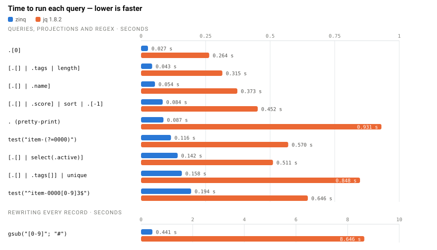
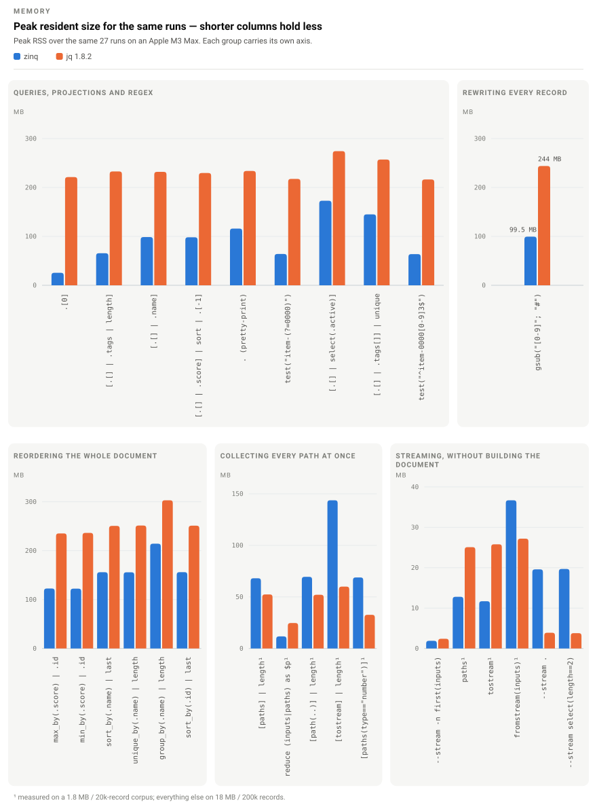
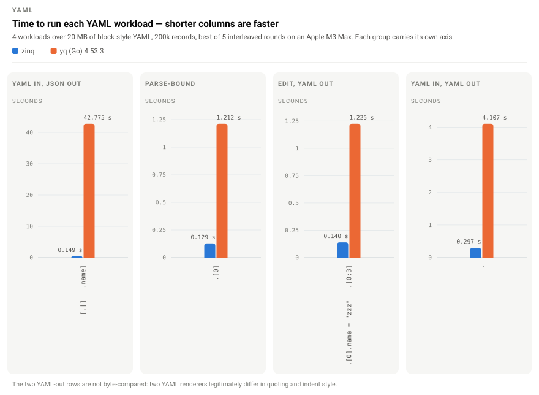
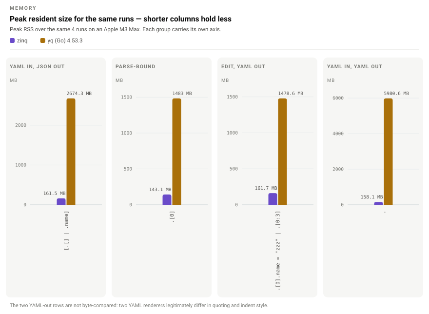

# homebrew-zinq

`zinq` is a fast, low-memory, jq-compatible JSON and YAML processor.

Existing jq scripts should just work: same filters, same flags, same output,
same exit codes — typically in a fifth of the time and a third of the memory.
Every jq 1.8.2 builtin is implemented, and the output is checked against real jq
by differential tests and by jq's own test suite.

Reads `~/.zinq`; copy your `~/.jq` over if you want to reuse it.
A few other things differ; they're listed under [Gaps and differences](#gaps-and-differences).

> **zinq is beta.** It's pre-1.0 and hasn't seen much production use yet. Check
> its output before you put it somewhere that matters, and keep jq around.
> Provided as is, without warranty of any kind — use at your own risk.

zinq is Apache-2.0. The source isn't public yet — see
[Releases](#releases) — but the licence applies to the binaries you install
today, not just to whatever gets published later.

## Performance

Every JSON benchmark is compared to jq's output byte for byte before it is
timed — a faster number means nothing if the bytes differ.

<picture>
  <source media="(prefers-color-scheme: dark)" srcset="assets/speed-dark.svg">
  
</picture>

<picture>
  <source media="(prefers-color-scheme: dark)" srcset="assets/memory-dark.svg">
  
</picture>

Together the 27 run in **3.9 s against jq's 20.3 s**, at a median peak of
**66 MB against 218 MB**. Two kinds of workload go the other way: two of the
collect-every-path rows, and `--stream`.

<details>
<summary>Every measurement</summary>

| Benchmark | zinq | jq | zinq peak | jq peak |
|---|---:|---:|---:|---:|
| `.[0]` | 0.024 s | 0.262 s | 26 MB | 220 MB |
| `[.[] \| .tags \| length]` | 0.041 s | 0.293 s | 66 MB | 218 MB |
| `[.[] \| .name]` | 0.044 s | 0.352 s | 80 MB | 218 MB |
| `[.[] \| .score] \| sort \| .[-1]` | 0.067 s | 0.428 s | 80 MB | 225 MB |
| `.` (pretty-print) | 0.081 s | 0.883 s | 116 MB | 227 MB |
| `test("item-(?=0000)")` | 0.100 s | 0.545 s | 64 MB | 215 MB |
| `[.[] \| select(.active) \| {name, score}]` | 0.130 s | 0.489 s | 140 MB | 278 MB |
| `[.[] \| .tags[]] \| unique` | 0.120 s | 0.710 s | 98 MB | 244 MB |
| `test("^item-0000[0-9]3$")` | 0.171 s | 0.632 s | 64 MB | 220 MB |
| `gsub("[0-9]"; "#")` | 0.383 s | 8.485 s | 81 MB | 244 MB |
| `max_by(.score) \| .id` | 0.048 s | 0.331 s | 74 MB | 225 MB |
| `min_by(.score) \| .id` | 0.048 s | 0.329 s | 74 MB | 225 MB |
| `unique_by(.name) \| length` | 0.073 s | 0.388 s | 95 MB | 231 MB |
| `sort_by(.name) \| last` | 0.072 s | 0.381 s | 96 MB | 251 MB |
| `group_by(.name) \| length` | 0.093 s | 0.403 s | 135 MB | 305 MB |
| `sort_by(.id) \| last` | 0.059 s | 0.371 s | 97 MB | 249 MB |
| `[paths] \| length` ¹ | 0.025 s | 0.119 s | 41 MB | 48 MB |
| `reduce (inputs\|paths) as $p (0;.+1)` ¹ | 0.032 s | 0.128 s | 12 MB | 24 MB |
| `[path(..)] \| length` ¹ | 0.025 s | 0.087 s | 43 MB | 48 MB |
| `[tostream] \| length` ¹ | 0.043 s | 0.283 s | 86 MB | 58 MB |
| `[paths(type=="number")]` ¹ | 0.055 s | 0.117 s | 42 MB | 32 MB |
| `--stream -n first(inputs)` | 0.003 s | 0.003 s | 2.0 MB ² | 2.4 MB |
| `paths` ¹ | 0.024 s | 0.176 s | 12 MB | 24 MB |
| `tostream` ¹ | 0.032 s | 0.397 s | 12 MB | 26 MB |
| `fromstream(inputs)` ¹ | 0.043 s | 0.341 s | 23 MB | 25 MB |
| `--stream .` | 1.028 s | 1.623 s | 20 MB ² | 3 MB |
| `--stream select(length==2)` | 1.016 s | 1.745 s | 20 MB ² | 3 MB |

¹ On a 1.8 MB / 20k-record corpus; everything else on 18 MB / 200k records.

² Counts the input file zinq maps into memory, not what it allocates. Piped,
with no file to map, `--stream .` peaks at 2.8 MB against jq's 3.3.

</details>

### YAML

The same filters read YAML directly, with no conversion step in front of them.
Same corpus, rendered as 20 MB of block-style YAML.

<picture>
  <source media="(prefers-color-scheme: dark)" srcset="assets/yaml-speed-dark.svg">
  
</picture>

<picture>
  <source media="(prefers-color-scheme: dark)" srcset="assets/yaml-memory-dark.svg">
  
</picture>

| Workload | zinq | yq | zinq peak | yq peak |
|---|---:|---:|---:|---:|
| Project a field into an array | 0.140 s | 41.904 s | 162 MB | 2674 MB |
| Parse-bound (read one field of the first record) | 0.121 s | 1.157 s | 143 MB | 1483 MB |
| Edit a value in place | 0.129 s | 1.155 s | 162 MB | 1479 MB |
| Round-trip YAML back out | 0.294 s | 3.782 s | 158 MB | 5981 MB |

The first row overstates the speed gap. yq is slow at collecting results into
an array specifically: asked for the same field as a stream it takes 2.3 s
rather than 42. The other three are the fairer comparison.

Memory is the wider gap, and it holds across all four. yq needs 1.5 GB to read
one field of the first record of a 20 MB file, and 6.0 GB to round-trip it
unchanged. zinq stays between 143 and 162 MB.

JSON measured 2026-08-02 against jq 1.8.2; YAML measured 2026-08-01
against yq (Go) 4.53.3. One machine, an Apple M3 Max. Linux builds ship but
their numbers are not published.

## Install

```sh
brew tap dennisvr/zinq
brew trust dennisvr/zinq
brew install zinq
```

The `brew trust` step is required. Homebrew 6 refuses to load formulae from
third-party taps until they are trusted explicitly, so without it `brew install`
fails with `Refusing to load formula dennisvr/zinq/zinq from untrusted tap`.
Trusting the tap covers its current and future formulae; if you would rather
grant the narrowest possible permission, use
`brew trust --formula dennisvr/zinq/zinq` instead and repeat it after each
upgrade.

Once the tap is trusted, the one-line form works too:

```sh
brew install dennisvr/zinq/zinq
```

## Usage

Same filters and flags as jq:

```sh
zinq '.[] | select(.active) | .name' users.json
zinq -r '.[].name' users.json
curl -s https://api.example.com/items | zinq -c '.[0]'
```

`.yaml` and `.yml` files are detected by suffix; `--yaml-input` and
`--yaml-output` force it either way:

```sh
zinq '.spec.replicas' deploy.yaml
zinq --yaml-output '.metadata.labels.env = "prod"' deploy.yaml
```

`zinq --help` lists every flag and the filters implemented so far.

## Gaps and differences

Output matches jq byte for byte except where noted here.

**Not there yet.**

- **YAML edits lose comments and layout.** Output is clean block style; use yq
  if you need round-tripping.
- **YAML `.inf`, `-.inf` and `.nan` don't round-trip.** They read as
  `1.7976931348623157e+308`, its negation, and `null`. yq keeps them. JSON is
  unaffected.
- **`have_decnum` is false.** Literal text survives, so a wide integer
  round-trips, but arithmetic is doubles — as it is in jq. One real difference:
  `1E1234567890` prints as written, where jq saturates it.
- **Parse errors are worded differently.** Same file, line and caret; the
  sentence after them is zinq's, not bison's.

**Deliberate.**

- **`~/.zinq` replaces `~/.jq`.** A file is loaded as a library; a directory is
  added to the search path.
- **Three builtins jq 1.8.2 dropped still work:** `leaf_paths`, `pow10` and
  `toarray`.

## Releases

Binaries are prebuilt and attached to this repo's
[GitHub Releases](https://github.com/dennisvr/homebrew-zinq/releases). Each
release ships one executable per platform — macOS Apple Silicon/Intel and Linux
x86_64/ARM64 — with oniguruma statically linked, so there is no separate regex
library to install. The macOS builds are self-contained. The Linux builds link
glibc dynamically and are produced on Ubuntu 24.04, so they need glibc 2.39 or
newer.

The `zinq` source is not public yet. It's written in a language that is itself
still under development; the plan is to open the source once that settles. The
binaries are Apache-2.0 in the meantime, and each tarball carries a copy of the
licence.

Releases are published here automatically: CI in the private source repo builds
the per-platform binaries, creates the Release on this repo with the tarballs
attached, and commits the matching bump to `Formula/zinq.rb`. The formula is
therefore generated — don't edit it by hand.

## Upgrade & uninstall

```sh
brew upgrade zinq
brew uninstall zinq
```

## Licence

Apache License 2.0. See [LICENSE](LICENSE).
